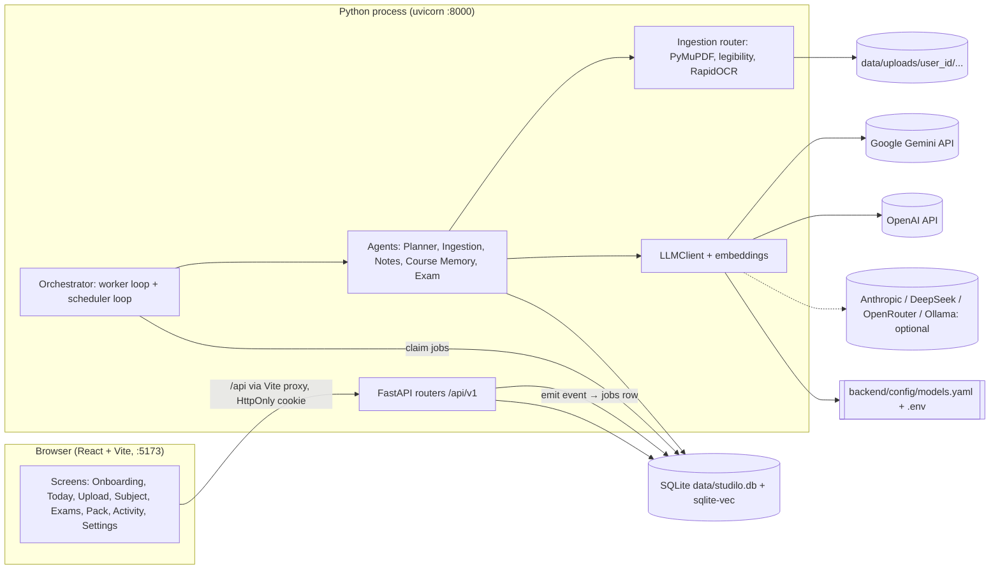
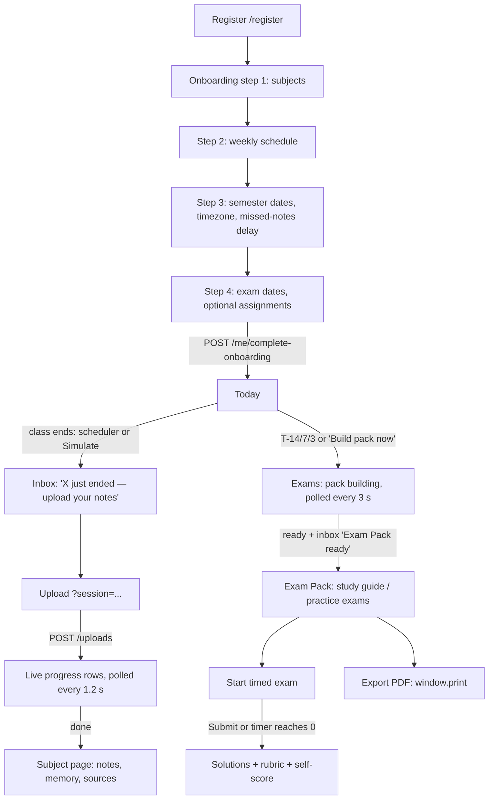
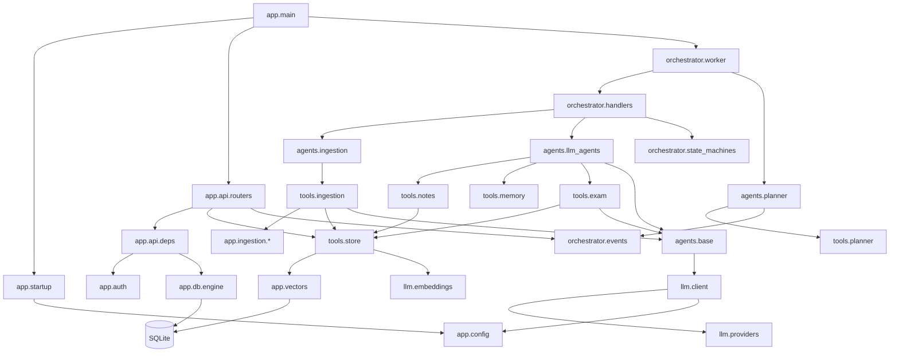
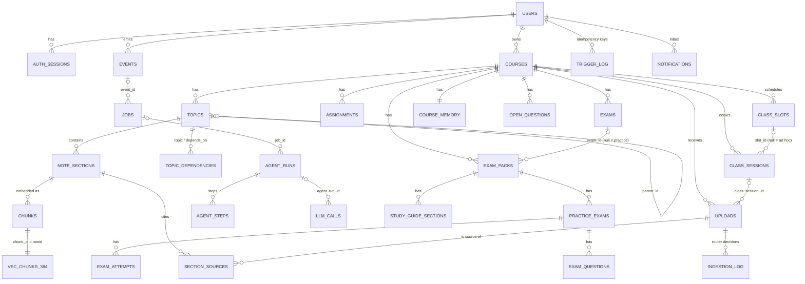
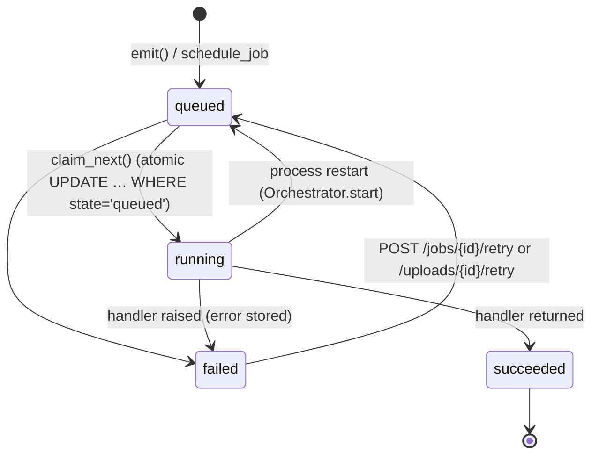
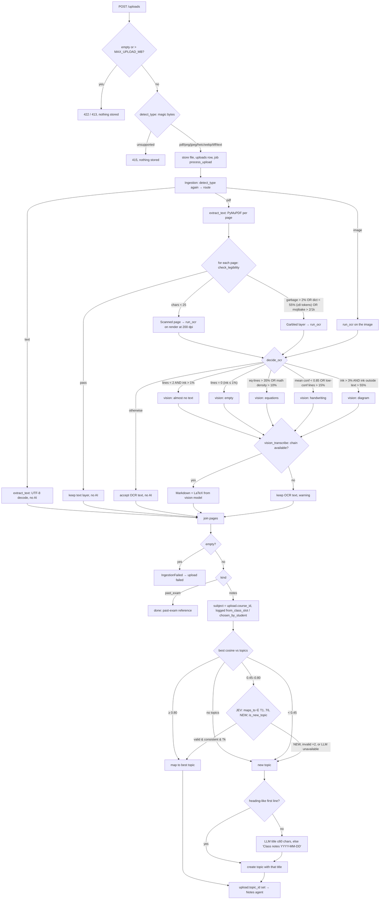

# Studilo v1 — System walkthrough

Snapshot of branch `studilo-v1` at commit `fb05a3e` (2026-09-24). All paths are relative to the repo root.
Paths starting with `app/` or `tests/` are under `backend/`.

**Status legend.**
- ✅ Implemented and working: a test covers it, or it was run live on 2026-09-24.
- 🟡 Partial: the code exists but is untested, only covered by the scripted test model, or incomplete.
- ❌ Planned only: the item appears in the docs or the spec, not in the code.

**Evidence base.**
- `cd backend && uv run pytest -q` gives **49 passed** (run while writing this document).
- Frontend `npm run typecheck` and `npm run build` pass. There are **no frontend tests**.
- The following was run live through the Vite proxy with `make dev`:
  - health check, register, onboarding;
  - past-exam uploads of a text PDF, a scanned PDF, a garbled PDF and a clean PNG, with local OCR and 0 LLM calls;
  - a simulated scheduler tick that put a class-end prompt in the inbox;
  - "Test connection" for Google and OpenAI (it only lists models, so it is free);
  - fail-fast startup with an emptied `OPENAI_API_KEY`.

**Important caveat.** No real LLM completion has ever been run: no chat, no tool calls, no vision request. Every agent
run above the ingestion layer has only been exercised against the test-only scripted provider
(`tests/fakes.py:23`). This is why several items below are 🟡.

> Note: the task brief was cut off in section 9 ("How topic assignment works: embedding thresholds, when…").
> Sections 1–9 follow the brief. Section 9 covers topic assignment completely from the code. Three
> appendices cover what the ground rules and the intro also ask for: installation (A), discrepancies (B)
> and bugs (C).

---

## 1. Executive summary

Studilo is a local-first web app for engineering students. The student:
1. Registers and configures subjects, a weekly class schedule, semester dates and exam dates.
2. Studilo detects when a class slot ends and puts an "upload your notes" prompt in an in-app inbox.
3. The student uploads a PDF, photos, or text. A deterministic router extracts the content. It uses
   a text layer, then local OCR, and a vision LLM only when needed.
4. An LLM **Notes agent** merges the content into per-topic notes, with sources.
5. An LLM **Course Memory agent** records the session summary, pace, dependencies and open questions.
6. At T-14/T-7/T-3 days before each exam, an LLM **Exam agent** builds an **Exam Pack**. The pack is a
   study guide plus N practice exams with solutions and rubrics, each question verified by a second
   model and citing note sections.

Everything runs in **one Python process**: FastAPI, an in-process job worker, and a scheduler loop.
It uses **one SQLite file** (with sqlite-vec for vectors) and a Vite/React frontend.



**Journey status**

| Step | Status | Evidence |
|------|--------|----------|
| Setup (subjects, slots, semester, exams, onboarding gate) | ✅ API, 🟡 UI | `tests/conftest.py:108` `onboard()`; `tests/test_e2e.py`. UI builds but has no automated test. |
| End-of-class upload prompt | ✅ | `tests/test_triggers.py::test_class_ended_prompts_for_notes_once`; seen live in the inbox |
| Ingestion (router) | ✅ deterministic paths; 🟡 real vision call | `tests/test_ingestion_router.py` (9 tests); live zero-cost uploads. The vision path only ran against the scripted model. |
| Structured notes | 🟡 | Notes agent loop tested only with the scripted model (`tests/fakes.py:73`). The deterministic fallback is covered by code but not by a dedicated test. |
| Course memory (summaries, pace, missed sessions) | ✅ missed-session flagging (deterministic); 🟡 LLM parts | `tests/test_triggers.py::test_missed_slot_is_flagged…`; LLM part scripted only |
| Exam dates → triggers T-14/7/3 | ✅ | `tests/test_triggers.py::test_exam_approaching_at_t14_t7_t3_once_each` |
| Exam Pack | 🟡 | `tests/test_exam_pack.py` with the scripted model only. The real models (`gpt-5.6-terra`, `gemini-3.5-flash`) have never produced a pack. |

---

## 2. Business and product decisions

Each rule lists where it lives and how to change it.
- **config** means an environment variable or `models.yaml`.
- **user** means a per-user setting in the UI.
- **code** means a constant in the source.

### 2.1 Product rules

| Rule | Behaviour | Where | Change via | Status |
|------|-----------|-------|-----------|--------|
| Onboarding gate | The user cannot reach the app until they have ≥1 subject, ≥1 weekly slot and semester dates. Exams are optional. | `app/api/routers/setup.py:43-58` | code | ✅ `tests/test_e2e.py` (409 before setup) |
| Journey states | `onboarding → active` only | `app/orchestrator/state_machines.py:37` | code | ✅ |
| Classes are followed only inside the semester | The Planner skips dates before `semester_start` or after `semester_end` | `app/agents/planner.py:46` | user (Settings → Profile) | ✅ `test_no_class_prompts_outside_the_semester` |
| When a class "ends" | Slot end time in the **user's timezone** ≤ now. Only **today and yesterday** are checked. | `app/agents/planner.py:44-54`, `app/orchestrator/timeutil.py:7` | code | ✅ `test_local_timezone_is_respected` |
| End-of-class prompt | Session becomes `awaiting_upload`. An `upload_prompt` notification is created, and a `check_missed_upload` job is scheduled at `ends_at + missed_after_hours`. | `app/orchestrator/handlers.py:63-85` | — | ✅ |
| Missed session flag | A session still `awaiting_upload` **N hours** after it ended (N = `users.missed_after_hours`, default 12) becomes `missed`, and a reminder is sent. Two independent detectors (scheduler tick and scheduled job) are made idempotent by the trigger key `missed:<session>`. | `app/agents/planner.py:56-64`, `app/orchestrator/handlers.py:88-115`, default at `app/db/models.py:35` | user (Settings → Profile, 1–168 h, `app/api/schemas.py:48`) | ✅ |
| Late upload clears "missed" | `missed → uploaded → processed` is allowed | `app/orchestrator/state_machines.py:39-45` | code | ✅ |
| Exam Pack triggers | `exam_approaching` fires once per threshold in `(14, 7, 3)` days before the exam. If several thresholds are crossed at once (exam added late), it fires once with the smallest crossed one. | `app/agents/planner.py:19`, `:66-78` | code | ✅ |
| Rebuilds | Every trigger creates a **new pack version** (v+1). Old versions are kept. The agent is told which note sections changed since the last ready pack. | `app/orchestrator/handlers.py:256-260`, `app/tools/exam.py:98-130` | — | 🟡 (version logic is covered by code, not asserted by a test) |
| Practice exams per pack | `EXAM_PACK_PRACTICE_EXAMS` (default **2**) | `app/config/settings.py:63`, `app/orchestrator/handlers.py:263` | config (env) | ✅ (tests set it to 2) |
| Questions per practice exam | `EXAM_PACK_QUESTIONS_PER_EXAM` (default **4**; tests use 2) | `app/config/settings.py:64` | config (env) | ✅ |
| Pack completeness | `save_exam_pack` refuses to save unless every practice exam has ≥ N verified, non-replaced questions, there are no unverified ones, and the study guide is non-empty | `app/tools/exam.py:224-249` | code | ✅ (scripted) |
| Question grounding | Every question and guide section must cite ≥1 note section **of the same subject**. The rubric points must sum to the question's points (±0.01). | `app/tools/exam.py:34-43`, `:167-192` | code | ✅ |
| Question verification | Three booleans must all be true: `solvable_with_given_data`, `units_consistent`, `answer_supported_by_notes`. Otherwise the question is `rejected` and the agent must redraft it. | `app/tools/exam.py:91-96`, `:195-221` | prompt `backend/prompts/exam_verifier.md` | ✅ (scripted, including one forced rejection) |
| Exam scope | By default **every topic of the subject**. The exam's free-text `scope_note` is passed to the agent, which is told to respect it. There is **no hard filter**. | `app/tools/exam.py:98-130`, `backend/prompts/exam_agent.md` step 1 | prompt | 🟡 (depends on model obedience) |
| Past exams | Uploads with `kind=past_exam` are ingested only: no notes merge, no topic. The Exam agent reads the 3 most recent (first 6,000 chars each) as a style reference. | `app/orchestrator/handlers.py:160-162`, `app/tools/exam.py:144-151` | code | ✅ |
| No pack without notes | A build fails fast, with no LLM spend, if the subject has 0 note sections | `app/orchestrator/handlers.py:252-255` | code | ✅ `test_failures_are_recorded_not_swallowed` |
| Solutions hidden by default | `GET /packs/{id}` and `/practice-exams/{id}` hide solutions unless `?reveal=true`. The server does not check whether an attempt was submitted. | `app/api/routers/exams.py:44-57` | code | ✅ |
| Attempt locking | Answers cannot change after submission (409). Self-scores can. | `app/api/routers/exams.py:119-128` | code | ✅ |
| Notes are incremental | The Notes agent can only `append_section` or `revise_section` (one section), and must always cite source uploads | `app/tools/notes.py:36-45`, `:78-92`; `app/tools/store.py:73-109` | code | ✅ (scripted) |
| Content never lost | If the Notes agent links nothing to the upload, the full extracted text is appended verbatim as a section | `app/orchestrator/handlers.py:211-220` | code | 🟡 (no dedicated test) |
| Upload limits | `MAX_UPLOAD_MB` default 25 per file. Only PDF/PNG/JPEG/HEIC/WEBP/TIFF/UTF-8 text are accepted. | `app/api/routers/uploads.py:26-66`, `app/ingestion/detect.py:13` | config / code | ✅ 415 test |
| Session lifetime | 14 days (`SESSION_TTL_DAYS`) | `app/config/settings.py:56` | config | ✅ |

### 2.2 Cost-affecting decisions

| Decision | Where | Reason recorded |
|----------|-------|-----------------|
| Typed or legible PDFs and clean printed photos use **zero LLM calls** | `app/ingestion/decisions.py:43-74` | D-05 / brief "deterministic first" |
| Ingestion and Planner agents have **no LLM** | `app/agents/ingestion.py`, `app/agents/planner.py` | D-05: "a typed PDF must cost zero LLM calls" |
| Topic assignment asks an LLM only in the ambiguous similarity band 0.45–0.80 | `app/ingestion/decisions.py:78-95` | D-13 |
| Missed-session flagging uses no LLM | `app/orchestrator/handlers.py:97-115` | D-05 |
| Exam pack build refuses to run without notes | `app/orchestrator/handlers.py:254` | none recorded |
| Cheap vs strong models per task | `backend/config/models.yaml` (see §7) | D-15 |
| Embeddings are local (fastembed), free, with a free hashing fallback | `backend/config/models.yaml:15`, `app/llm/embeddings.py:99-127` | D-12 |
| Provider "Test connection" lists models instead of calling a completion (free) | `app/llm/providers.py:136-144`, `:220-224` | none recorded |
| Agent step limits cap the worst-case spend: Notes 16, Memory 12, Exam **80** | `app/agents/llm_agents.py:11-42` | none recorded |
| Tool results are truncated to 12,000 chars before being sent back to the model | `app/agents/base.py:32`, `:270-275` | none recorded |

---

## 3. UX: the client's path



### 3.1 Screens

All screens: 🟡. They typecheck and build, and the endpoints they call are covered by backend tests. But no UI
test exists, and I did not click through the screens myself. The live checks were API calls.

| Screen | File | Purpose / what the user sees | Actions | Endpoints | Empty / error states |
|--------|------|------------------------------|---------|-----------|----------------------|
| Auth | `frontend/src/pages/Auth.tsx` | Log in / register form | submit, switch mode | `POST /auth/login`, `POST /auth/register` (`Auth.tsx:25-26`) | inline error box; minimum 8 characters on register |
| App shell + Inbox | `frontend/src/components/Layout.tsx` | Sidebar (Today, Upload, one entry per subject, Exams, Activity, Settings), bell with unread count | open item (marks it read and navigates), mark all read, enable browser notifications, log out | `GET /courses`, `GET /inbox?limit=30` every 15 s (`Layout.tsx:76-77`), `POST /inbox/{id}/read`, `POST /inbox/read-all`, `POST /auth/logout` | "Nothing yet."; the 401 handler redirects to `/login?next=` (`App.tsx:40-47`, `api.ts`) |
| Onboarding | `frontend/src/pages/Onboarding.tsx` | 4-step wizard with a progress bar | add/remove subjects, slots, exams, assignments; save semester; Finish | `/courses`, `/slots`, `/courses/{id}/slots`, `PUT /me/profile`, `/exams`, `/assignments`, `POST /me/complete-onboarding` | Next is disabled until the step is valid (`Onboarding.tsx:34`). A server 409 jumps back to the failing step (`:28-33`). |
| Today | `frontend/src/pages/Today.tsx` | Pending uploads (awaiting/missed), today's classes, upcoming exams with a countdown and pack state, agent activity feed | Upload notes, Build pack now | `GET /sessions` (15 s), `/slots`, `/exams`, `/packs` (10 s), `/activity/feed` (10 s), `POST /exams/{id}/build-pack` | "All caught up", "No classes today", "No exams yet", first-run explainer |
| Upload | `frontend/src/pages/Upload.tsx` | Subject / which class / kind selectors, drop zone, Choose files, Take photo (`capture="environment"`), phone QR panel, progress list | upload, retry, open notes, expand "How was this read?" (ingestion log table) | `GET /sessions`, `POST /uploads` (multipart), `GET /uploads?limit=10` (5 s), `GET /uploads/{id}` (1.2 s until done/failed, `Upload.tsx:151-152`), `POST /uploads/{id}/retry`, `GET /settings/lan` | error box on the POST; per-row red failure plus Retry; amber text for warnings; "No LAN address found" |
| Subject | `frontend/src/pages/Subject.tsx` | Header with pace and missed count. Tabs: **Notes** (topic tree, KaTeX note with source chips, semantic search), **Course memory** (session timeline, pace, dependencies, open questions), **Sources** (uploads table) | practice exam, resolve question, open source file, upload late notes | `GET /courses/{id}`, `/courses/{id}/memory`, `/courses/{id}/topics`, `/topics/{id}/note`, `/notes/search`, `POST /courses/{id}/practice-exam`, `POST /open-questions/{id}/resolve`, `/uploads?course_id=`, `/uploads/{id}/file` | "No notes yet — upload now", "No sessions yet", 404 → NotFound |
| Exams | `frontend/src/pages/Exams.tsx` | One card per exam: date, countdown, scope, packs with state and trigger, live job progress; practice packs; exam editor | Build/Refresh pack, Retry failed job, add/remove exams and assignments | `/exams`, `/packs` (3 s while building, otherwise 15 s), `/jobs?limit=40` (3 s), `POST /exams/{id}/build-pack`, `POST /jobs/{id}/retry` | "No pack yet: it will be built automatically…", error box plus Retry |
| Exam Pack | `frontend/src/pages/ExamPack.tsx` | Tabs: Study guide (with citations) and Practice exams. Timed mode. | Export PDF (with or without solutions), show solutions, start timed exam, submit, save self-scores | `GET /packs/{id}?reveal=`, `POST /practice-exams/{id}/attempts`, `PUT /attempts/{id}`, `GET /practice-exams/{id}?reveal=true` | skeleton; 404 → NotFound |
| Activity | `frontend/src/pages/Activity.tsx` | Cost and step summary cards, bars (cost by task, calls by model, ingestion paths), agent runs table, trace viewer, LLM calls table | select a run | `/activity/summary`, `/activity/runs`, `/activity/llm-calls` (10 s), `/activity/runs/{id}` (2 s while running) | "No data yet", "Select a run" |
| Settings | `frontend/src/pages/Settings.tsx` | Providers (masked key, used-by, Test connection), models per task (editable), profile, subjects, schedule, Simulate panel | Test, edit model mapping, emit `class_ended` / missed / `exam_approaching`, run scheduler at a chosen time | `/settings/providers`, `POST /settings/providers/{name}/test`, `/settings/models`, `PUT /settings/models/{task}`, `POST /events`, `POST /simulate/tick` | error box shows the server's 422, which names the missing key |

### 3.2 UX decisions

| Decision | What | Why | Trade-off |
|----------|------|-----|-----------|
| Onboarding order: subjects → schedule → semester → exams | `Onboarding.tsx:12-17` | Each step depends on the previous one: slots need subjects, and the Planner needs slots and semester dates. Exams are optional, so they come last and can be skipped. (Reason stated in `UX.md` §2, not in DECISIONS.) | Timezone and semester sit in step 3. The user must press **Save** in that step before Next is enabled (`Onboarding.tsx:34`, `:62`). |
| Upload progress in plain language | Each router or agent step writes `uploads.status_message` (`app/orchestrator/handlers.py:119-124`, `:148`). The UI polls it every 1.2 s and shows a six-stage bar. | `UX.md` principle 2: "Show the work, not the plumbing" | Polling, not push (no websockets): simpler, at most ~1 s delay. |
| Notifications | DB `notifications` rows → the inbox polls every 15 s → the browser `Notification` API for new unread items after the first load (`Layout.tsx:84-93`) | D-16: "Browser notifications use the Notification API from the inbox poller." | Only works while a tab is open. See the friction points below. |
| Phone upload | The Vite dev server runs with `--host`. The Upload screen shows a QR code of the LAN URL. | D-16 | Only works with `make dev`. There is no production server (Appendix B). |
| PDF export via print | `window.print()` plus print CSS (`frontend/src/index.css:24-30`) | D-09: avoids WeasyPrint system dependencies | The user must choose "Save as PDF". The 600 ms delay may print before revealed solutions load (bug C-9). |
| Self-grading only | No LLM grading of answers | none recorded (cost) | Scores are the student's own. |

### 3.3 Gaps and friction points

1. **Browser notifications do not work on a phone over the LAN.** The Notification API requires a
   secure context (HTTPS or localhost); the phone uses `http://<LAN-IP>:5173`. This is standard browser
   behaviour, not verified on a device.
2. No UI to **edit** an exam, course or assignment, or to mark an assignment done. The backend supports
   `PATCH /exams/{id}`, `PUT /courses/{id}` and `PATCH /assignments/{id}`, but the UI only adds and removes.
3. **Past attempts are not visible.** `GET /practice-exams/{id}/attempts` exists but no screen uses it.
4. The Today screen's "today's classes" uses the **browser clock**, while the Planner uses the user's
   configured timezone (`Today.tsx:26-29` vs `app/agents/planner.py:37-38`).
5. The phone must log in separately. The QR code opens `/upload`, which redirects to login.
6. The Upload screen offers "which class" only for existing sessions. There is no way to create a
   session for a past date before the scheduler has created it.
7. There is no password reset or account deletion.
8. Deleting a subject asks for a JS `confirm()`. It leaves uploaded files on disk (bug C-6).
9. The error UX is an inline `ErrorBox`, not the toasts described in `UX.md` (Appendix B).

---

## 4. Modules

| Path | Responsibility | Main classes / functions | Depends on | Status |
|------|----------------|--------------------------|------------|--------|
| `app/main.py` | App factory, lifespan (validate → migrate → start orchestrator), `/health` | `create_app` (:40), `lifespan` (:24) | config, startup, api, orchestrator, db | ✅ |
| `app/startup.py` | Fail-fast validation; Alembic upgrade; `python -m app.startup` | `validate_settings` (:14), `run_migrations` (:28) | config | ✅ |
| `app/config/settings.py` | Typed env settings, masking, path resolution | `Settings` (:36), `mask_secret` (:27), `PROVIDER_KEY_ENV` (:15) | pydantic-settings | ✅ |
| `app/config/models_config.py` | `models.yaml` schema, hot reload, write-back, key validation, cost | `ModelsConfigStore` (:119), `validate_models_config` (:95), `ModelsConfig.cost` (:78) | settings, ruamel | ✅ |
| `app/db/base.py` | Declarative base, `UserOwned` mixin, UTC datetimes | `UserOwned` (:48), `UTCDateTime` (:31) | SQLAlchemy | ✅ |
| `app/db/engine.py` | Engine (loads sqlite-vec, WAL), scoped / system sessions, **scoping hooks** | `scoped_session_for` (:73), `_scope_selects` (:114), `_scope_writes` (:127) | base, settings | ✅ |
| `app/db/models.py` | ORM schema (27 tables) | see §6 | base | ✅ |
| `app/db/migrations/` | Alembic env + revision `0001` | `versions/0001_initial_schema.py` | models | ✅ |
| `app/vectors.py` | sqlite-vec store partitioned by user | `upsert` (:38), `knn` (:55), `ensure_table` (:24) | db | ✅ |
| `app/auth/security.py` | bcrypt, session tokens (HMAC-stored) | `hash_password` (:19), `create_session` (:35), `resolve_session` (:42) | settings, models | ✅ |
| `app/api/deps.py` | `CurrentUser`, user-scoped `DB`, `get_or_404` | `current_user` (:29), `get_db` (:42) | auth, engine | ✅ |
| `app/api/schemas.py` | Request and response Pydantic models | — | — | ✅ |
| `app/api/routers/*.py` | HTTP endpoints (see §5) | — | deps, tools, orchestrator | ✅ / 🟡 per endpoint |
| `app/llm/types.py` | Message, tool-call and response types, errors | `LLMResponse` (:41), `CallContext` (:56), `LLMUnavailable` (:70) | — | ✅ |
| `app/llm/providers.py` | Wire adapters: OpenAI-compatible, Anthropic, local | `OpenAICompatAdapter` (:56), `AnthropicAdapter` (:147), `provider_specs` (:28) | httpx, settings | 🟡 only `test_connection` ran live; completions never ran live; the Anthropic adapter is completely untested |
| `app/llm/client.py` | Task → model routing, fallback chain, structured output with retry, `llm_calls` logging | `LLMClient.chat` (:41), `.structured` (:70), `_log` (:97) | providers, models_config, db | ✅ (scripted provider; fallback and failure logging tested) |
| `app/llm/embeddings.py` | Embedders: hashing, fastembed, OpenAI; chain selection | `get_embedder` (:99), `HashingEmbedder` (:32), `FastEmbedder` (:54) | models_config | ✅ hashing (tests); 🟡 fastembed (never loaded in tests or live); 🟡 OpenAI embeddings (never run) |
| `app/ingestion/detect.py` | Magic-byte file type | `detect_type` (:13) | — | ✅ |
| `app/ingestion/legibility.py` | Text-layer legibility | `check_legibility` (:67), `LegibilityThresholds` (:22) | wordfreq, ftfy | ✅ |
| `app/ingestion/ocr.py` | Image load (incl. HEIC), preprocess, RapidOCR, metrics | `run_ocr` (:102), `preprocess` (:62) | opencv, rapidocr, pillow-heif | ✅ (HEIC decoding 🟡) |
| `app/ingestion/decisions.py` | Pure routing decisions and thresholds | `decide_pdf_page` (:43), `decide_ocr` (:58), `topic_band` (:88) | detect, legibility, ocr | ✅ |
| `app/ingestion/chunker.py` | LaTeX-aware chunker | `split_text` (:33) | — | ✅ |
| `app/agents/base.py` | Tool, ToolContext, AgentTrace, tool-loop agent | `ToolLoopAgent.run` (:213), `AgentTrace` (:129), `clean_schema` (:81), `load_prompt` (:107) | llm, db | ✅ |
| `app/agents/ingestion.py` | Deterministic router policy | `IngestionAgent._run` (:52) | tools/ingestion | ✅ |
| `app/agents/planner.py` | Deterministic trigger policy | `PlannerAgent.plan` (:34) | tools/planner, orchestrator/events | ✅ |
| `app/agents/llm_agents.py` | Notes / Course Memory / Exam agent definitions | `NotesAgent` (:11), `CourseMemoryAgent` (:22), `ExamAgent` (:33) | tools | 🟡 (scripted only) |
| `app/tools/store.py` | Shared scoped domain operations (topics, sections, sources, indexing, search) | `append_section` (:73), `reindex_section` (:112), `search_notes` (:132) | vectors, embeddings | ✅ |
| `app/tools/ingestion.py` | 6 ingestion tools + ingestion_log writes | `classify_topic_tool` (:191), `vision_transcribe_tool` (:139) | ingestion/*, llm | ✅ |
| `app/tools/notes.py` | 6 Notes tools | `update_topic_note_tool` (:78) | store | ✅ (scripted) |
| `app/tools/memory.py` | 7 Course Memory tools, `computed_pace` | `computed_pace` (:43), `flag_missed_session_tool` (:132) | store, state_machines | ✅ |
| `app/tools/exam.py` | 8 Exam tools | `verify_question_tool` (:195), `save_exam_pack_tool` (:224) | store, llm | ✅ (scripted) |
| `app/tools/planner.py` | 5 Planner tools | `PLANNER_TOOLS` (:88) | db | ✅ (`get_course_memory` is never called: 🟡) |
| `app/orchestrator/state_machines.py` | Journey / ClassSession / Upload / ExamPack / Job machines | `transition` (:76) | — | ✅ |
| `app/orchestrator/events.py` | `emit` (event + job), idempotency `once` | `emit` (:30), `once` (:43), `EVENT_TO_JOB` (:21) | models | ✅ |
| `app/orchestrator/handlers.py` | Job handlers (the journey pipeline) | `handle_process_upload` (:145), `handle_build_exam_pack` (:247), `HANDLERS` (:300) | agents, tools | ✅ |
| `app/orchestrator/worker.py` | Claim/run jobs, drain, tick, background loops | `claim_next` (:27), `run_job` (:42), `tick` (:92), `Orchestrator` (:114) | handlers, planner | ✅ (drain/tick via tests); 🟡 background loops (observed live, no test) |
| `backend/prompts/*.md` | Versioned system prompts (all `version: 1`) | notes_agent, course_memory_agent, exam_agent, exam_verifier, vision_transcribe | — | ✅ loaded by tests |
| `frontend/src/api.ts` | fetch wrapper, 401 event | `api` | — | 🟡 |
| `frontend/src/App.tsx` | Routing by auth and journey state | `useMe`, `App` | pages | 🟡 |
| `frontend/src/components/*` | Layout + inbox, editors, UI primitives (Markdown + KaTeX) | `Layout`, `CoursesEditor`, `Markdown` | api | 🟡 |
| `frontend/src/pages/*` | Screens (§3) | — | components | 🟡 |
| `scripts/ensure_secret.py` | Generates `APP_SECRET_KEY` in `.env` | — | — | ✅ (ran during `make dev`) |



---

## 5. API endpoints

All endpoints are mounted under `/api/v1` (`app/main.py:44`).
- **Auth "yes"** means the HttpOnly `studilo_session` cookie is required, resolved by `app/api/deps.py:29`.
  `tests/test_auth.py::test_every_non_public_endpoint_requires_auth` enumerates the OpenAPI schema and
  asserts 401 without the cookie for every non-public route.
- **Status.** ✅ means a test exercises the success path. 🟡 (probe) means it is only exercised as a
  foreign-id 404 or an empty-list probe in `tests/test_isolation.py`.

| Method | Path | Auth | Request | Response | Handler | Triggers | Status |
|---|---|---|---|---|---|---|---|
| POST | /auth/register | no | `RegisterIn` (email, password ≥8, display_name) | `MeOut` + cookie | `routers/auth.py:27` | — | ✅ |
| POST | /auth/login | no | `LoginIn` | `MeOut` + cookie | `auth.py:41` | — | ✅ |
| POST | /auth/logout | no | cookie | 204 (row deleted) | `auth.py:51` | — | ✅ |
| GET | /auth/me | yes | — | `MeOut` | `auth.py:59` | — | ✅ |
| GET | /health | no | — | `{status, db}`, 503 if the DB fails | `main.py:46` | — | ✅ (live) |
| PUT | /me/profile | yes | `ProfileIn` | `MeOut` | `routers/setup.py:30` | — | ✅ |
| POST | /me/complete-onboarding | yes | — | `MeOut`, 409 with the missing items | `setup.py:42` | Journey → active | ✅ |
| GET | /courses | yes | — | `CourseOut[]` | `setup.py:77` | — | ✅ |
| POST | /courses | yes | `CourseIn` | `CourseOut` (+ `course_memory` row) | `setup.py:82` | — | ✅ |
| GET | /courses/{id} | yes | — | `CourseOut` | `setup.py:91` | — | ✅ |
| PUT | /courses/{id} | yes | `CourseIn` | `CourseOut` | `setup.py:96` | — | 🟡 (probe) |
| DELETE | /courses/{id} | yes | — | 204 | `setup.py:104` | — | 🟡 (probe) |
| GET | /slots | yes | — | `SlotOut[]` | `setup.py:110` | — | ✅ |
| POST | /courses/{id}/slots | yes | `SlotIn` (weekday 0–6, HH:MM, end > start) | `SlotOut` | `setup.py:115` | — | ✅ |
| DELETE | /slots/{id} | yes | — | 204 | `setup.py:124` | — | 🟡 (probe) |
| GET | /exams | yes | — | `ExamOut[]` | `setup.py:130` | — | ✅ |
| POST | /exams | yes | `ExamIn` | `ExamOut` | `setup.py:135` | picked up by the next tick (T-14/7/3) | ✅ |
| PATCH | /exams/{id} | yes | `ExamPatch` | `ExamOut` | `setup.py:144` | — | 🟡 (probe) |
| DELETE | /exams/{id} | yes | — | 204 | `setup.py:152` | — | 🟡 (probe) |
| GET / POST | /assignments | yes | — / `AssignmentIn` | `AssignmentOut[]` / `AssignmentOut` | `setup.py:158,163` | — | 🟡 (GET probe only; POST untested) |
| PATCH | /assignments/{id}?done= | yes | query `done` | `AssignmentOut` | `setup.py:172` | — | 🟡 untested |
| DELETE | /assignments/{id} | yes | — | 204 | `setup.py:179` | — | 🟡 untested |
| POST | /uploads | yes | multipart: `files[]`, `course_id`, `class_session_id?`, `kind` notes\|past_exam | `UploadOut[]` (201); 413/415/422 | `routers/uploads.py:26` | event `upload_completed` → job `process_upload` | ✅ |
| GET | /uploads | yes | `course_id?`, `limit` | `UploadOut[]` | `uploads.py:69` | — | ✅ |
| GET | /uploads/{id} | yes | — | `UploadDetailOut` (+ extracted_md, ingestion log) | `uploads.py:77` | — | ✅ |
| GET | /uploads/{id}/file | yes | — | the file, with magic-byte media type, `nosniff`, CSP | `uploads.py:91` | — | ✅ |
| POST | /uploads/{id}/retry | yes | — | `UploadOut` (409 if not failed) | `uploads.py:101` | requeues the job or emits `upload_completed` | 🟡 (probe) |
| GET | /sessions | yes | `course_id?`, `state?`, `limit` | `ClassSessionOut[]` | `uploads.py:117` | — | ✅ |
| GET | /courses/{id}/topics | yes | — | `TopicOut[]` with section counts | `routers/notes.py:25` | — | ✅ |
| GET | /topics/{id}/note | yes | — | `TopicNoteOut` (sections + sources) | `notes.py:34` | — | ✅ |
| GET | /notes/search | yes | `q` (2–300), `course_id?` | `SearchHit[]` | `notes.py:46` | — | ✅ isolation; 🟡 relevance |
| GET | /courses/{id}/memory | yes | — | `CourseMemoryOut` | `notes.py:54` | — | ✅ |
| POST | /open-questions/{id}/resolve | yes | — | `OpenQuestionOut` | `notes.py:71` | — | 🟡 untested |
| GET | /packs | yes | `exam_id?`, `course_id?` | `ExamPackOut[]` | `routers/exams.py:34` | — | ✅ |
| GET | /packs/{id} | yes | `reveal` bool | `ExamPackDetailOut` | `exams.py:59` | — | ✅ |
| POST | /exams/{id}/build-pack | yes | — | `JobOut` (202) | `exams.py:83` | event `exam_approaching` (manual) → `build_exam_pack` | ✅ |
| POST | /courses/{id}/practice-exam | yes | — | `JobOut` (202) | `exams.py:90` | event `exam_requested` → `build_exam_pack` | ✅ |
| GET | /practice-exams/{id} | yes | `reveal` | `PracticeExamOut` | `exams.py:97` | — | 🟡 (probe) |
| POST | /practice-exams/{id}/attempts | yes | — | `AttemptOut` | `exams.py:103` | — | ✅ |
| GET | /practice-exams/{id}/attempts | yes | — | `AttemptOut[]` | `exams.py:112` | — | 🟡 (probe) |
| PUT | /attempts/{id} | yes | `AttemptSubmitIn` | `AttemptOut`, 409 if answers change after submit | `exams.py:119` | — | ✅ |
| GET | /jobs | yes | `limit`, `state?` | `JobOut[]` | `routers/activity.py:35` | — | ✅ |
| GET | /jobs/{id} | yes | — | `JobOut` | `activity.py:43` | — | ✅ |
| POST | /jobs/{id}/retry | yes | — | `JobOut` (409 unless failed) | `activity.py:48` | failed → queued | ✅ |
| POST | /events | yes | `EventIn` (type ∈ class_ended, class_slot_passed_without_upload, exam_approaching, exam_requested) | `JobOut` (202) | `activity.py:59` | the same event mapping as the scheduler | ✅ |
| POST | /simulate/tick | yes | `TickIn` (`now?`, tz-aware) | `{now, actions}` | `activity.py:87` | Planner for this user only | ✅ |
| GET | /inbox | yes | `unread?`, `limit` | `NotificationOut[]` | `activity.py:98` | — | ✅ |
| POST | /inbox/{id}/read | yes | — | `NotificationOut` | `activity.py:106` | — | 🟡 (probe) |
| POST | /inbox/read-all | yes | — | 204 | `activity.py:113` | — | 🟡 untested |
| GET | /activity/runs | yes | `limit`, `agent?` | `AgentRunOut[]` | `activity.py:120` | — | ✅ |
| GET | /activity/runs/{id} | yes | — | `{run, steps, llm_calls}` | `activity.py:134` | — | ✅ |
| GET | /activity/llm-calls | yes | `limit` | `LLMCallOut[]` | `activity.py:143` | — | ✅ |
| GET | /activity/summary | yes | — | `SummaryOut` | `activity.py:161` | — | ✅ |
| GET | /activity/feed | yes | `limit` | `FeedItem[]` | `activity.py:191` | — | 🟡 (probe) |
| GET | /settings/providers | yes | — | `ProviderStatus[]` (masked) | `routers/settings.py:20` | — | ✅ |
| POST | /settings/providers/{name}/test | yes | — | `{ok, message}` | `settings.py:38` | lists models (no tokens) | ✅ (live) |
| GET | /settings/models | yes | — | `ModelsOut` | `settings.py:62` | — | 🟡 untested via API |
| PUT | /settings/models/{task} | yes | `TaskMappingIn` | `ModelsOut`, 422 naming a missing key | `settings.py:72` | writes `models.yaml` (global) | 🟡 (store-level tested in `test_config.py`, route untested) |
| GET | /settings/lan | yes | `port` | `{urls}` | `settings.py:89` | — | 🟡 untested |

**Job status now returns real states. ✅**
- `GET /jobs/{id}` (`activity.py:43`) returns the persisted `jobs.state`.
- The worker changes that state under the Job state machine: `queued → running` in `app/orchestrator/worker.py:27-39`, and `running → succeeded | failed` in `worker.py:64-75`.
- Upload rows carry their own state and message (`app/orchestrator/handlers.py:119-124`).
- `tests/test_agents_and_status.py::test_status_moves_through_real_states` asserts `queued` before and `succeeded` after, and upload `received` → `done`.
- `test_failures_are_recorded_not_swallowed` asserts `failed` with the error text.

**Root cause of the old always-`PROCESSING` bug** (recorded in `CHANGELOG.md` before the fix):
1. The old `check_exam_status()` in `src/services/learning/api/routes.py` returned the literal
   `"PROCESSING"` without reading anything.
2. No job row existed to read. The publisher only sent a RabbitMQ message. The worker wrote the PDF to MinIO and only
   logged success, and it swallowed errors.

That code is deleted. It is still viewable in git history before `8e36787`.

---

## 6. Data and storage

### 6.1 Engine
- **SQLite 3.53.1** (Python's bundled sqlite3 in the uv-managed CPython 3.12), **SQLAlchemy 2.0.54**, **Alembic 1.20.0**,
  **sqlite-vec 0.1.9**. These versions were read from the installed environment.
- The connection loads sqlite-vec, sets `foreign_keys=ON`, `journal_mode=WAL` and `busy_timeout=10000`
  (`app/db/engine.py:31-39`).
- **Why:** D-03, quoted: "One file (`data/studilo.db`) plus `data/uploads/<user_id>/…`. Zero services to run."
  D-18: "SQLite with sync SQLAlchemy is the simplest correct choice".
- **Trade-off:** there is a single writer. Jobs run in separate threads so a job waiting on the lock
  never blocks another job's progress (D-18, `app/orchestrator/worker.py:132-157`). The discarded alternative was
  Postgres + Qdrant + MinIO (the old stack).

### 6.2 Schema
- Source of truth: `app/db/models.py`. Migration: `app/db/migrations/versions/0001_initial_schema.py`, the only
  revision. It also creates the virtual table `vec_chunks_384` (`vec0`, `user_id TEXT PARTITION KEY`,
  cosine metric).
- Primary keys are UUID strings, except `chunks.id`, which is an integer so it can serve as the vec rowid.
- Every table except `users` and `auth_sessions` has `user_id` through `UserOwned` (`app/db/base.py:48-53`), with an FK to
  `users` and `ON DELETE CASCADE`.



Key columns, with line numbers in `app/db/models.py`:
- `users` (:26): email unique, password_hash, journey_state, timezone, semester_start/end, missed_after_hours.
- `auth_sessions` (:38): token_hash (HMAC-SHA256, unique), expires_at.
- `class_slots` (:56): weekday, start_time/end_time "HH:MM" local.
- `class_sessions` (:83): unique (slot_id, session_date); state, summary_md, topic_ids JSON, missed_reason.
- `uploads` (:99): kind, detected_type, storage_path, sha256, state, status_message, error, **extracted_md**, topic_id, job_id.
- `ingestion_log` (:120): step, path_taken, reason, legibility_score, ocr_confidence, scores JSON, model_used, tokens_in/out, cost_usd, latency_ms.
- `topics` (:138): embedding BLOB (float32), embedding_model.
- `note_sections` (:157): heading, content_md, version.
- `chunks` (:175): int PK, text, embedding_dim.
- `course_memory` (:189): topics_per_week, syllabus_position, pace_note.
- `jobs` (:215): type, state, payload/result JSON, error, attempts, run_after, progress.
- `trigger_log` (:230): unique (user_id, key).
- `agent_runs` (:248): agent, mode, prompt_version, task, state, goal, output, error, steps, llm_calls, cost_usd.
- `agent_steps` (:265): idx, kind, name, input/output JSON, ok, latency_ms.
- `llm_calls` (:277): task, provider, model, tokens, cost_usd, priced, latency_ms, ok, error, is_fallback, reason.
- `exam_packs` (:295): version, trigger, state, notes_cutoff, built_at.
- `exam_questions` (:326): statement_md, solution_md, rubric JSON, points, cited_section_ids JSON, state, verification JSON.

### 6.3 `user_id` isolation ✅
The layer is the **SQLAlchemy session**, not the route handlers.
- **Read scoping.** `scoped_session_for(user_id)` (`app/db/engine.py:73`) tags the session. On every ORM
  SELECT/UPDATE/DELETE, `_scope_selects` (`:113-123`) adds `with_loader_criteria(UserOwned, user_id == uid)`.
  Relationship loads and `session.get()` are covered as well.
- **No unscoped queries.** A session without a user raises `ScopeViolation` unless it is explicitly a system session (`:116-119`).
- **Write scoping.** `_scope_writes` (`:126-136`) stamps `user_id` on new rows and raises `ScopeViolation` when a
  foreign-owned object is flushed.
- **Routes.** They get the scoped session via `get_db` (`app/api/deps.py:42`). A foreign id is therefore
  indistinguishable from a missing one (`get_or_404`, `:60`).
- **Tools.** `ToolContext.db` is the job owner's scoped session (`app/orchestrator/worker.py:42-55`). Tool
  argument schemas never contain `user_id`, and `Tool.invoke` rejects one if passed (`app/agents/base.py:68-72`).
- **Vectors.** Scoped by partition key (§6.4).
- **System sessions.** Used only for auth lookup, the user row, scheduler fan-out and job claiming.

Proof: `tests/test_isolation.py`.
- `test_every_id_endpoint_hides_foreign_rows`: 25 foreign-id probes plus 4 write attempts, all 404.
- `test_list_and_search_endpoints_return_nothing_foreign`
- `test_vector_store_is_partitioned_by_user`
- `test_scoped_session_filters_and_blocks_foreign_writes`
- `test_agent_tools_cannot_reach_foreign_rows`, which includes the `user_id` injection case
- `tests/test_agents_and_status.py::test_tool_schemas_never_expose_user_id`

### 6.4 Vector store
- **What is embedded:** chunks of **note sections** (heading + content) (`app/tools/store.py:112-129`), every time a
  section is appended or revised (`app/tools/notes.py:78-92`). Topics also carry an embedding BLOB used for
  topic assignment, computed in Python rather than in sqlite-vec (`app/tools/ingestion.py:205-213`).
  **Raw uploads are not embedded.**
- **Chunking:** `split_text(chunk_size=1200, overlap=150)` (`app/ingestion/chunker.py:33`).
  - It splits paragraphs on blank lines.
  - It never closes a chunk while a `$$…$$` block is open (`:14-15`, `:44`).
  - Paragraphs over the size limit are split on sentence boundaries, except when they contain `$$` (`:18-30`).
- **Embedding model:** the `embeddings` task. The default is `fastembed/sentence-transformers/paraphrase-multilingual-MiniLM-L12-v2`
  (384-d), with fallback `local/hashing-384` (`backend/config/models.yaml:15`, `app/llm/embeddings.py:99-127`). Tests use
  hashing (`tests/conftest.py:22`).
  - 🟡 fastembed has never been loaded, because no notes upload happened in live runs.
  - Its first use downloads the model into `data/models/` (`app/llm/embeddings.py:57`).
- **Retrieval:** `vectors.knn` issues `… WHERE embedding MATCH :emb AND k = :k AND user_id = :uid`
  (`app/vectors.py:55-66`). `user_id` is the vec0 **partition key**, so the KNN never considers other users' vectors.
  `search_notes` then post-filters by course and topic through the scoped session, which returns `None` for
  foreign rows (`app/tools/store.py:132-153`). It requests `k*4` (min 20) neighbours to survive that post-filter.
- **Why:** D-03 ("the KNN query itself is constrained by user, so unscoped retrieval is impossible, not merely
  filtered afterwards") and D-12.

### 6.5 Files on disk
```
data/                         # DATA_DIR, default ./data at the repo root (gitignored)
├── studilo.db  (+ -wal, -shm)
├── uploads/<user_id>/<upload_id>.<ext>   # raw uploads; ext from detected type (app/api/routers/uploads.py:22-24, 52-54)
└── models/                   # fastembed model cache (created on first use)
```
- **Extracted text:** `uploads.extracted_md` (DB column).
- **Generated notes:** `note_sections` rows (DB).
- **Exam Packs:** `exam_packs`, `study_guide_sections`, `practice_exams` and `exam_questions` rows (DB). No pack files
  are written; PDF export is client-side printing.
- Nothing else is written to disk.

### 6.6 Logs, traces, costs
- **Application logs:** stdout/stderr only, via `logging.basicConfig` (`app/main.py:19`). There is no log file.
- **Agent traces:** `agent_runs` + `agent_steps` (`app/agents/base.py:129-178`).
- **Cost records:** `llm_calls`, one row per attempt including failures (`app/llm/client.py:97-110`), and per-step
  router costs in `ingestion_log`. Aggregates come from `GET /activity/summary`.

---

## 7. External providers and configuration

### 7.1 Providers and models (`backend/config/models.yaml`)

| Task | Primary | Fallback chain | Used by | Price in/out per 1M tokens (yaml) |
|------|---------|----------------|---------|-----------------------------|
| jev_classification | google / gemini-3.1-flash-lite | openai/gpt-5.6-luna | topic JEV + new-topic title (`app/tools/ingestion.py:226`, `:249`) | 0.25 / 1.50 |
| vision_transcribe | google / gemini-3.1-flash-lite | google/gemini-3.5-flash | vision escalation (`app/tools/ingestion.py:147`) | 0.25 / 1.50 |
| notes_structuring | google / gemini-3.5-flash | openai/gpt-5.6-luna | Notes agent | 1.50 / 9.00 |
| course_memory | google / gemini-3.5-flash | openai/gpt-5.6-luna | Course Memory agent | 1.50 / 9.00 |
| exam_generation | openai / gpt-5.6-terra | google/gemini-3.5-flash | Exam agent | 2.00 / 12.00 |
| exam_verification | google / gemini-3.5-flash | openai/gpt-5.6-luna | `verify_question` | 1.50 / 9.00 |
| embeddings | fastembed / paraphrase-multilingual-MiniLM-L12-v2 | local/hashing-384 | chunk and topic embeddings | local, free |

Provider endpoints (`app/llm/providers.py:28-38`):

| Provider | Endpoint | Adapter |
|----------|----------|---------|
| openai | `https://api.openai.com/v1` | OpenAI-compatible |
| deepseek | `https://api.deepseek.com/v1` | OpenAI-compatible |
| openrouter | `https://openrouter.ai/api/v1` | OpenAI-compatible |
| google | `https://generativelanguage.googleapis.com/v1beta/openai` | OpenAI-compatible |
| ollama | `$OLLAMA_BASE_URL/v1` | OpenAI-compatible |
| anthropic | `https://api.anthropic.com/v1/messages` | native Anthropic |
| local, fastembed | in-process | embeddings only |

- **Live-verified 2026-09-24:** the Google and OpenAI keys authenticate, and all 12 configured model IDs exist in the providers' model lists.
- **Why (D-15):** "The owner's pre-existing `.env` had Google and OpenAI keys".
- **Two adapters (D-08):** "two adapters for six providers, without adding six SDKs"; LiteLLM rejected.
- 🟡 **Not verified:** that these models accept the request shapes sent. For example, OpenAI chat
  completions send `max_completion_tokens` only if `max_tokens` is configured (`app/llm/providers.py:97-98`), and Gemini's OpenAI-compatible
  endpoint must accept tool calls. The Gemini thought-signature echo is implemented generically through the `extra` field
  (`app/llm/providers.py:71`, `:118`) but is untested.

### 7.2 Environment variables (`.env.example`, loaded by `app/config/settings.py:36-64`)

| Variable | Purpose | Required? |
|----------|---------|-----------|
| ANTHROPIC_API_KEY, OPENAI_API_KEY, DEEPSEEK_API_KEY, GOOGLE_API_KEY, OPENROUTER_API_KEY | Provider keys | **Required only if the provider appears in `models.yaml`** (primary or fallback). With the committed yaml, **GOOGLE_API_KEY and OPENAI_API_KEY are required**. |
| OLLAMA_BASE_URL | Ollama server URL (default `http://localhost:11434`) | optional; no key |
| EMBEDDINGS_API_KEY | Key for `provider: openai` embeddings | required only if the embeddings task uses openai (`app/config/models_config.py:109-111`) |
| APP_SECRET_KEY | HMAC key for session tokens | **required, ≥32 chars** (`app/startup.py:14-19`). `make setup` generates it (`scripts/ensure_secret.py`). |
| DATABASE_URL | SQLite URL; relative paths resolve from the repo root (`settings.py:82-91`) | optional (default `sqlite:///./data/studilo.db`) |
| DATA_DIR | Uploads, DB and model cache | optional |
| COOKIE_SECURE | Secure flag on the cookie | optional (false) |
| SESSION_TTL_DAYS | Login lifetime | optional (14) |
| MAX_UPLOAD_MB | Per-file limit | optional (25) |
| ENABLE_BACKGROUND | Start the worker + scheduler in-process | optional (true) |
| SCHEDULER_INTERVAL_SECONDS | Tick period | optional (30) |
| WORKER_CONCURRENCY | Parallel jobs | optional (2) |
| EXAM_PACK_PRACTICE_EXAMS | Practice exams per pack | optional (2) |
| EXAM_PACK_QUESTIONS_PER_EXAM | Verified questions per practice exam | optional (4) |
| MODELS_CONFIG | Path to `models.yaml` | optional |

- `MISSED_UPLOAD_AFTER_HOURS` exists in `Settings` (`settings.py:62`) but is **not in `.env.example` and never read**. The per-user
  column is used instead (Appendix B).

### 7.3 Secret loading and validation ✅
1. pydantic-settings reads the environment and `REPO_ROOT/.env` (`settings.py:37-39`). Keys are `SecretStr`, so they are masked in
   `repr`. `provider_key()` strips and returns `None` for empty values (`:98-106`).
2. `make dev` runs `make check`, which is `python -m app.startup` (`Makefile:21-24`). It then starts uvicorn, whose lifespan validates again and
   exits with a clear message (`app/main.py:24-31`).
3. The validation (`app/config/models_config.py:95-116`) requires:
   - all 7 known tasks are present;
   - every referenced provider is known;
   - every referenced provider that needs a key has one.
   The error message names the env var and the tasks that need it.
   - Verified live, and covered by `tests/test_config.py::test_missing_provider_key_fails_fast_naming_the_key`.
4. Keys never leave the server. `/settings/providers` returns `mask_secret()` output (`sk-...a3f9`).
   `test_settings_api_masks_keys` asserts that the raw value is absent.
5. `PUT /settings/models/{task}` re-validates before writing (`models_config.py:140-161`).

### 7.4 Secrets in the tree or history (files only)
- **Current tracked tree:** gitleaks finds nothing in commits `eff5d11..HEAD` (run 2026-09-24).
- **Pre-pivot git history** (still reachable):
  - `src/services/ai/.env`, `src/services/auth/.env`, `src/services/vectordb/.env`. Earliest commits: `f8d1d39`, `18ddf27`,
    `ab8b0cf` (2025-07/08). Key names include OPENAI, ANTHROPIC, COHERE and PINECONE keys, JWT_SECRET and DB_PASSWORD.
  - `check_models.py` (commit `336f7132`, 2025-12-24): a Google API key. Checked: it is not the one in the current `.env`.
- **Local, gitignored files holding real keys:** `.env`, and `.env.legacy-backup` (the previous `.env`).
- `git stash@{0}` holds the pre-pivot uncommitted changes. Unknown whether it contains secrets; check with
  `git stash show -p stash@{0} | gitleaks stdin`.

---

## 8. Agents and orchestration

### 8.1 Agents

| Agent | Mode | Prompt | Tools | Step limit | Stop condition | Model task |
|-------|------|--------|-------|-----------|----------------|------------|
| Planner/Scheduler (`app/agents/planner.py:22`) | deterministic | — | `get_schedule`, `get_exam_dates`, `get_course_memory` (**unused**), `create_reminder`, `schedule_job` (`app/tools/planner.py:88-94`) | n/a | end of `plan()` | none |
| Ingestion (`app/agents/ingestion.py:36`) | deterministic | (vision tool uses `prompts/vision_transcribe.md`) | `detect_type`, `extract_text`, `check_legibility`, `run_ocr`, `vision_transcribe`, `classify_topic` (`app/tools/ingestion.py:273-286`) | n/a | end of policy, or `IngestionFailed` | vision_transcribe, jev_classification (only when escalating) |
| Notes (`app/agents/llm_agents.py:11`) | LLM tool loop | `prompts/notes_agent.md` v1 | `search_notes`, `get_topic_note`, `update_topic_note`, `create_topic`, `link_source`, `finish`* (`app/tools/notes.py:118-127`) | 16 | terminal `finish` succeeds (it refuses if no section was touched, `notes.py:111-115`) | notes_structuring |
| Course Memory (`llm_agents.py:22`) | LLM tool loop (+ deterministic missed handler) | `prompts/course_memory_agent.md` v1 | `get_sessions`, `append_session_summary`, `update_course_pace`, `flag_missed_session`, `add_open_question`, `link_topics`, `finish`* (`app/tools/memory.py:176-189`) | 12 | terminal `finish` succeeds (requires a summary first, `memory.py:170-173`) | course_memory |
| Exam (`llm_agents.py:33`) | LLM tool loop | `prompts/exam_agent.md` v1 (+ `exam_verifier.md` inside `verify_question`) | `get_exam_scope`, `search_notes`, `read_sections`, `get_past_exams`, `add_study_guide_section`, `draft_question`, `verify_question`, `save_exam_pack`* (`app/tools/exam.py:252-268`) | 80 | terminal `save_exam_pack` succeeds | exam_generation (+ exam_verification) |

`*` marks the terminal tool. The tool argument schemas are the Pydantic classes next to each tool:
- `notes.py:26-60`
- `memory.py:61-94`
- `exam.py:46-96`
- `planner.py:21-41`
- `ingestion.py:31-42`

They are sent to the model through `clean_schema()` (`app/agents/base.py:81-104`), which inlines `$ref`s, collapses `Optional`, and
drops titles and defaults.

**Loop mechanics** (`app/agents/base.py:213-267`):
1. Commit the DB session.
2. Call `LLMClient.chat(task, messages, tools)`.
3. Record an `llm` step.
4. If there are no tool calls and the agent requires a terminal tool, nudge it up to 2 times, then fail.
5. Otherwise execute each call:
   - Unknown tools, bad JSON arguments, validation errors and `ToolError` are returned to the model as `{"error": …}`.
   - Unexpected exceptions are logged, the session is rolled back, and the error is returned to the model.
6. A successful terminal tool ends the run as `succeeded`.
7. Exhausting `max_steps` gives `step_limit`.
8. `LLMUnavailable` (the whole fallback chain failed) marks the run `failed` and re-raises.

Tests:
- `tests/test_agents_and_status.py::test_loop_runs_tools_feeds_results_back_and_stops_on_terminal`
- `…::test_invalid_args_and_user_id_injection_are_rejected_back_to_the_model`
- `…::test_step_limit_stops_the_loop`

### 8.2 Orchestrator

**Events → jobs** (`app/orchestrator/events.py:21-27`). `emit()` writes an `events` row and a `jobs` row in the caller's
transaction (`:30-40`).

| Event | Job type | Handler |
|-------|----------|---------|
| `class_ended` | `class_ended` | `handle_class_ended` (`handlers.py:63`): Planner, deterministic |
| `class_slot_passed_without_upload` | `missed_upload` | `handle_missed_upload` (`:97`): Course Memory, deterministic |
| `upload_completed` | `process_upload` | `handle_process_upload` (`:145`): Ingestion → Notes → Course Memory |
| `exam_approaching`, `exam_requested` | `build_exam_pack` | `handle_build_exam_pack` (`:247`): Exam agent |
| (no event; created by the `schedule_job` tool) | `check_missed_upload` | `handle_check_missed` (`:88`) |

**Job state machine** (`app/orchestrator/state_machines.py:64-69`):



Domain machines:
- **Upload:** `received → extracting → classifying → structuring → updating_memory → done`. Past exams go `classifying → done`. Any state can go to `failed`, and `failed → received` on retry (`:47-55`).
- **ClassSession:** `scheduled → awaiting_upload → uploaded → processed`, with `awaiting_upload → missed → uploaded` (`:39-45`).
- **ExamPack:** `pending → building → ready | failed` (`:57-62`).

**Execution** (`app/orchestrator/worker.py`):
1. `Orchestrator.start()` (`:120-124`) re-queues jobs left `running` and starts two asyncio tasks.
2. The worker loop (`:132-144`) polls every 1 s and claims up to `WORKER_CONCURRENCY` jobs. Each runs as `asyncio.run(run_job())` in its own
   thread (`:156-157`, D-18).
3. `run_job` (`:42-77`) builds a `ToolContext` with the job owner's scoped session and dispatches through `HANDLERS`.
4. The scheduler loop (`:146-153`) calls `tick()` every `SCHEDULER_INTERVAL_SECONDS` in a thread.

**Retries and failures:**
- There are **no automatic retries**. `attempts` is incremented on each claim (`:35-36`), but a failed job stays failed until a
  user retries it.
- Handlers mark their domain row failed before re-raising:
  - upload (`handlers.py:184-192`);
  - pack (`_fail_pack`, `:292-297`).
- The notes and memory agents failing is **not fatal**. The failure becomes a warning, and the notes fallback runs (`:203-220`, `:234-239`).

### 8.3 Triggers

| Trigger | Fired by | Condition | Launches | Configured in |
|---------|----------|-----------|----------|---------------|
| `class_ended` | Planner tick (`planner.py:44-54`) or `POST /events` | slot end ≤ now, date ∈ {today, yesterday} in the user's timezone, inside the semester; key `class_ended:<slot>:<date>` | `class_ended` job → upload prompt + `check_missed_upload` job | code; the timezone and semester are user settings |
| `class_slot_passed_without_upload` | Planner tick (`:56-64`), `check_missed_upload` job (`handlers.py:88-94`), or `POST /events` (oldest awaiting session) | `awaiting_upload` and `ends_at ≤ now − missed_after_hours`; key `missed:<session>` | `missed_upload` job → flag + reminder | user setting `missed_after_hours` |
| `upload_completed` | `POST /uploads` (`uploads.py:63`) | every uploaded file | `process_upload` | — |
| `exam_approaching` | Planner tick (`planner.py:66-78`) or `POST /exams/{id}/build-pack` / `POST /events` | 0 ≤ days_left ≤ 14/7/3; key `exam_approaching:<exam>:T-<n>` | `build_exam_pack` | code constant `EXAM_THRESHOLDS` (`planner.py:19`) |
| `exam_requested` | `POST /courses/{id}/practice-exam` | on demand | `build_exam_pack` (exam_id null) | — |
| Scheduler tick | background loop every 30 s, or `POST /simulate/tick` with an injected `now` | all `active` users (or the calling user) | Planner | `SCHEDULER_INTERVAL_SECONDS` |

Tests: `tests/test_triggers.py` (7 tests), `tests/test_e2e.py`.

### 8.4 Sequence: class_ended → upload → ingestion → notes → course memory

```mermaid
sequenceDiagram
  participant S as Scheduler tick
  participant P as PlannerAgent
  participant DB as SQLite
  participant W as Worker thread
  participant UI as Browser
  participant API as FastAPI
  participant I as IngestionAgent
  participant N as NotesAgent (LLM)
  participant M as CourseMemoryAgent (LLM)
  S->>P: plan(now)
  P->>DB: once("class_ended:slot:date"), emit(class_ended)
  W->>DB: claim job class_ended
  W->>DB: session awaiting_upload, notification upload_prompt, job check_missed_upload(run_after=end+N h)
  UI->>API: GET /inbox (15 s poll) → prompt
  UI->>API: POST /uploads (files, course_id, class_session_id)
  API->>DB: save file, uploads row, emit(upload_completed) → job process_upload
  W->>DB: claim process_upload; upload extracting
  W->>I: run(upload)
  I->>DB: ingestion_log rows (detect, extract, legibility / OCR / vision, subject, topic)
  I-->>W: markdown, topic_id
  W->>DB: upload classifying → structuring; session uploaded
  W->>N: run(goal = upload id, topic, content ≤30k chars)
  N->>N: get_topic_note → update_topic_note (append/revise, reindex chunks) → finish
  W->>DB: fallback append if nothing linked
  W->>DB: upload updating_memory
  W->>M: run(goal = session, touched topics, summary, excerpt ≤6k)
  M->>M: get_sessions → append_session_summary → update_course_pace → (link_topics, add_open_question) → finish
  W->>DB: session processed; upload done; notification "Notes merged"
  UI->>API: GET /uploads/{id} (1.2 s poll) shows each status_message
```

### 8.5 Sequence: exam_approaching → Exam Pack

```mermaid
sequenceDiagram
  participant P as PlannerAgent
  participant DB as SQLite
  participant W as Worker thread
  participant E as ExamAgent (exam_generation model)
  participant V as verifier (exam_verification model)
  P->>DB: once("exam_approaching:exam:T-14"), emit(exam_approaching, threshold=14)
  W->>DB: claim build_exam_pack
  W->>DB: 0 note sections? → JobFailed (no LLM)
  W->>DB: exam_packs v+1 (pending→building), practice_exams 1..N, notes_cutoff=now
  W->>E: run(goal)
  E->>DB: get_exam_scope, get_past_exams, read_sections/search_notes
  E->>DB: add_study_guide_section × topics (citations checked)
  E->>DB: draft_question × N·Q (citations + rubric sum checked)
  loop each question
    E->>V: verify_question → structured Verification
    V-->>DB: state verified / rejected
    E->>DB: draft_question(replaces_question_id) when rejected
  end
  E->>DB: save_exam_pack → completeness check → pack ready
  W->>DB: notification exam_pack; job succeeded(result.pack_id)
```

### 8.6 Inspecting past runs
- **UI:** Activity → click a run to see each step's input/output JSON, latency, and the run's LLM calls.
- **API:**
  - `GET /api/v1/activity/runs?agent=exam`
  - `GET /api/v1/activity/runs/{id}`
  - `GET /api/v1/activity/llm-calls`
- **SQL:**
  ```sql
  sqlite3 data/studilo.db "select agent, state, steps, cost_usd from agent_runs order by created_at desc limit 10"
  ```
  Then query `agent_steps where run_id=…`.

---

## 9. Ingestion router: every logic path

Policy in `app/agents/ingestion.py:52-114`. Tools in `app/tools/ingestion.py`. Pure decisions in `app/ingestion/decisions.py`.
Pre-check in the API (`app/api/routers/uploads.py:44-50`).

### 9.1 Decision tree



### 9.2 Decision table

Costs are **estimates**, computed from `models.yaml` prices with assumed token counts. **None has been measured
against a real provider.**

| # | Input | Check | Thresholds (where defined) | Outcome | LLM? | Approx. cost | Test |
|---|-------|-------|---------------------------|---------|------|--------------|------|
| 1 | Any | size | empty → 422; > `MAX_UPLOAD_MB` (25) → 413 (`uploads.py:44-48`) | rejected | no | $0 | — (untested) |
| 2 | Any | magic bytes | `%PDF-` in the first 1 KB; PNG/JPEG/HEIC-brand/WEBP/TIFF signatures; text = UTF-8, no NUL, not PK-zip, control chars ≤ 0.1% (`detect.py:13-44`) | unsupported → 415 | no | $0 | `test_detect_by_magic_bytes_not_extension`, `test_unsupported_file_rejected_before_processing` |
| 3 | Text file | decode | — | text kept verbatim | no | $0 | `test_subject_from_slot_and_topic_assignment` (c.txt) |
| 4 | PDF page, legible text layer | legibility | chars ≥ 25; garbage ≤ 0.02; dict ≥ 0.55 when ≥ 8 tokens; mojibake ≤ 2.0/1k (`legibility.py:22-27`) | text layer kept | no | $0 | `test_text_pdf_uses_text_layer_with_zero_llm_calls`, `test_real_world_text_pdf_fixture` |
| 5 | PDF page, no text layer (scan) | legibility | chars < 25 | OCR (→ 7–12) | no, unless escalated | $0 | `test_scanned_pdf_runs_ocr_and_accepts_clean_print` |
| 6 | PDF page, garbled text layer | legibility | any failed criterion from row 4 | OCR (→ 7–12) | no, unless escalated | $0 | `test_garbled_pdf_falls_back_to_local_ocr_without_llm`, `test_legibility_signals` |
| 7 | OCR result | almost no text | `lines < 2` (`decisions.py:19`) AND `ink_ratio > 0.01` (**hardcoded**, `decisions.py:60`) | vision, kind "handwriting" | yes: vision_transcribe (gemini-3.1-flash-lite) | ~$0.002/page (assumes ~1.5k in / ~0.8k out) | `test_ocr_decision_branches` (unit) |
| 8 | OCR result | empty | `lines == 0` and ink ≤ 0.01 (`decisions.py:62`) | vision, kind "empty" | yes | ~$0.002 | **none** |
| 9 | OCR result | equations | `equation_line_ratio > 0.35` OR `math_density > 0.10` (`decisions.py:17-18`) | vision, kind "equations" | yes | ~$0.002 | `test_equation_page_escalates_with_equation_reason`, unit |
| 10 | OCR result | handwriting / low confidence | `mean_confidence < 0.85` OR `low_conf_ratio > 0.15` (`decisions.py:15-16`) | vision, kind "handwriting" | yes | ~$0.002 | `test_handwriting_photo_escalates_to_vision_model`, unit |
| 11 | OCR result | diagrams | `ink_ratio > 0.03` AND `ink_outside_text_ratio > 0.55` (`decisions.py:20-21`) | vision, kind "diagram" | yes | ~$0.002 | unit only (`test_ocr_decision_branches`) |
| 12 | OCR result | none of the above | — | OCR text accepted | no | $0 | `test_clean_photo_is_accepted_locally`, rows 5/6 tests |
| 13 | Vision escalation | chain fails | every model in `vision_transcribe` fails (`LLMUnavailable`) | OCR text kept, warning, logged `vision_unavailable:kept_ocr`; failed attempts in `llm_calls` | attempted | $0 (failed calls) | `test_vision_outage_keeps_ocr_text_and_is_logged_not_silent` |
| 14 | All pages joined empty | — | — | `IngestionFailed` → upload `failed` | no | $0 | **none** |
| 15 | past_exam | kind | — | done, no topic, no notes | no | $0 | `test_exam_pack_is_grounded_verified_and_complete` (uploads a past exam); live |
| 16 | notes | subject | none: `upload.course_id` is always given | logged `subject:from_class_slot` or `chosen_by_student` | no | $0 | `test_subject_from_slot_and_topic_assignment` asserts "no AI needed" |
| 17 | notes | topic: none exist | `best is None` (`decisions.py:89`) | new topic | no* | $0 | `test_subject_from_slot_and_topic_assignment` (`embedding:new`) |
| 18 | notes | topic: strong match | cosine ≥ 0.80 (`decisions.py:78`) | map; topic embedding = normalize(0.8·old + 0.2·new) (`ingestion.py:260-262`) | no | $0 | same test (`embedding:map`) |
| 19 | notes | topic: weak match | cosine < 0.45 (`decisions.py:79`) | new topic | no* | $0 | `test_route_and_topic_bands` (unit) |
| 20 | notes | topic: ambiguous | 0.45 ≤ cosine < 0.80 | JEV (jev_classification). Maps if the answer is valid, consistent and `Tk`; otherwise NEW | yes, gemini-3.1-flash-lite (+1 retry) | ~$0.0003 (assumes ~0.9k in / 30 out; ×2 on retry) | unit bands only; integration accepts any outcome (**JEV path not asserted**) |
| 21 | new topic without a heading | title | `_derive_title` rules (`ingestion.py:170-180`) fail | LLM title ≤ 60 chars, else `Class notes YYYY-MM-DD` | yes, jev_classification | ~$0.0002 | **none** |

\* No LLM unless row 21 applies.

**Mixed PDFs.** Pages are routed independently (`app/agents/ingestion.py:87-95`), so one PDF can mix rows 4, 5 and 6.
There is no dedicated test.

### 9.3 Legibility check (`app/ingestion/legibility.py:67-92`)
- **chars:** non-whitespace characters on the page. If < 25, the result is "no usable text layer" and the other metrics are not computed.
- **garbage_ratio:** (U+FFFD + private-use (Co) + control characters other than \n\r\t + 5 × each `(cid:N)`) / chars. Fails if > 0.02.
- **dict_ratio:** the share of alphabetic tokens (≥2 letters, first 3,000 tokens) with `wordfreq.zipf_frequency ≥ 1.0` in any of
  en/es/ca/fr/de. Fails if < 0.55, and only counts when there are ≥ 8 tokens.
- **mojibake_per_1k:** `ftfy.badness.badness(text[:20000]) × 1000 / len`. Fails if > 2.0.
- **score** (display only, not used for decisions): 0.2·min(1, chars/300) + 0.3·max(0, 1 − 20·garbage) + 0.5·dict − 0.3 if mojibake.
- **Pass** = no failed criterion.
- **Why:** D-11, quoted: "`wordfreq` provides the dictionary-word ratio … `ftfy.badness` detects mojibake".

### 9.4 OCR scoring (`app/ingestion/ocr.py`)
- **Load** (`:44-48`): Pillow with pillow-heif, EXIF orientation, converted to BGR. PDF pages are rendered at 200 dpi (`app/tools/ingestion.py:28`, `:61-72`).
- **Preprocess** (`:62-76`):
  1. grayscale;
  2. downscale so the longest side is ≤ 2400 px;
  3. deskew when 0.5° ≤ |angle| ≤ 15°. The angle comes from `minAreaRect` over the Otsu ink pixels, normalised to [−45, 45) (`:79-85`);
  4. CLAHE (clip 2.0, 8×8 tiles).
- **Engine:** RapidOCR (PaddleOCR models on ONNX Runtime), a lazy singleton (`:88-99`). **Why:** D-10.
- **Metrics** (`:102-126`):
  - `mean_confidence`: the per-line score, weighted by text length.
  - `low_conf_ratio`: the share of lines with score < 0.7.
  - `lines`: the number of detected boxes.
  - `math_density`: math symbols (the `MATH_CHARS` set, `:23`) / non-space characters.
  - `equation_line_ratio`: lines containing `=` or ≥2 math symbols, divided by all lines.
  - `ink_ratio`: Otsu dark pixels / all pixels.
  - `ink_outside_text_ratio`: ink outside the OCR boxes / all ink.
  - `deskew_angle`.
- **Text assembly** (`:129-150`): boxes are sorted top to bottom. Boxes whose tops are within 0.5 × the median height form one line. A blank line
  (paragraph break) is inserted when the vertical gap exceeds 1.2 × the median height.
- **Decision order** is the first match in `decide_ocr` (`decisions.py:58-74`): almost-no-text → empty → equations → low confidence → diagram → accept.

### 9.5 Subject assignment
- **There is no automatic subject inference.** `POST /uploads` requires `course_id` (`uploads.py:30`), and a given
  `class_session_id` must belong to the same course (`:34-37`).
- The UI pre-selects the course from `?session=` or `?course=` (`frontend/src/pages/Upload.tsx:26`, `:35-37`). Otherwise it uses the first subject.
- `classify_topic` only **logs** the source: `from_class_slot` if the upload is linked to a slot session, otherwise
  `chosen_by_student` (`app/tools/ingestion.py:197-200`).
- An upload without a session is attached after ingestion by `_session_for_upload` (`handlers.py:127-142`). It uses a
  session of the same course on the upload's local date, or creates an ad-hoc one.

### 9.6 Topic assignment (the part where the brief was cut off)
1. Embed the first 3,000 characters of the extracted Markdown (`ingestion.py:202-206`).
2. Load the subject's topics. Any topic whose embedding is missing, or was made by a different embedding model, is
   re-embedded from `title + summary` (`:207-212`).
3. Compute the cosine similarity to each topic and take the best (`:213-215`). Bands are defined in `decisions.py:78-95`:
   - none → NEW;
   - ≥ 0.80 → map;
   - < 0.45 → NEW;
   - otherwise → JEV.
4. **JEV** (`:219-243`): the top ≤ 6 topics get aliases `T1…T6`. A Pydantic model is built on the fly with
   `maps_to: Literal["T1",…,"NEW"]` and `is_new_topic: bool`. `LLMClient.structured` asks for JSON matching that schema
   (JSON mode), validates it, and retries once with the validation error (`app/llm/client.py:70-89`).
   - Accept only if the answer is valid **and** consistent (`is_new_topic == (maps_to == "NEW")`) **and** not NEW.
   - Otherwise fall back to the safe default **NEW**. The path is logged `jev` or `jev_invalid_default_new`.
   - `LLMUnavailable` → NEW.
5. **New topic title** (`:244-258`):
   - the first Markdown heading (3–80 chars); else
   - a heading-like line (3–70 chars, ≤ 9 words, starts with a capital letter, no ending punctuation, < 1/3 digits); else
   - an LLM `TopicTitle` (3–60 chars, validated); else
   - `Class notes YYYY-MM-DD`.
   The new topic's embedding is the excerpt embedding.
6. **Map:** the topic embedding drifts towards the new content (0.8/0.2 blend, `:260-262`).
7. Everything is logged in `ingestion_log` as step `topic`, with best similarity, the top-5 candidates, model, tokens and cost (`:265-268`).

- **Why:** D-13: "embeddings first, JEV only in the ambiguous band".
- **Trade-off:** defaulting to NEW can create duplicate topics, but never merges notes into the wrong topic.

---

## Appendix A — Installation

| Requirement | Version | Why | Notes |
|-------------|---------|-----|-------|
| `uv` | tested with 0.11.25 | Python env + deps (`backend/pyproject.toml`, `uv.lock`) | uv downloads **CPython 3.12** itself (`backend/.python-version`; `requires-python >=3.11,<3.13`) |
| Node.js + npm | Vite 8 requires `^20.19.0 \|\| >=22.12.0` (read from `node_modules/vite/package.json`); tested with v22.23.1 | frontend | `frontend/.npmrc` pins `before=2026-09-17` |
| `make` | any (macOS ships one) | `Makefile` | — |
| Network on first run | — | PyPI/npm packages; the **fastembed model** (~220 MB, from the Hugging Face hub) on the first notes upload | offline, embeddings fall back to hashing (`app/llm/embeddings.py:99-127`) |
| Provider keys | — | the providers referenced in `models.yaml` (by default Google + OpenAI) | — |
| Optional: gitleaks | 8.30.1 tested | `make secrets-scan` | `brew install gitleaks` |

- **No system libraries are needed.** RapidOCR bundles its ONNX models, and opencv-headless, PyMuPDF and pillow-heif ship wheels.
- Tested only on macOS arm64. Linux and Windows are **Unknown**; check by running `make test` there.
- **Docker is not supported** (D-17). There is no compose file.

**Commands:**
- `cp .env.example .env`, fill in the keys, then `make dev` (`Makefile:24-29`).
- `make test` runs pytest, then the frontend typecheck and build.
- `make check` validates the configuration only.
- `make secrets-scan` runs gitleaks.

---

## Appendix B — Discrepancies (code vs. docs / spec)

1. **`MISSED_UPLOAD_AFTER_HOURS`** is declared (`app/config/settings.py:62`) but never read. The rule uses the per-user
   `users.missed_after_hours` (`app/agents/planner.py:57`, `app/orchestrator/handlers.py:80`). It is also absent from `.env.example`.
2. **"Every state change goes through `transition()`"** (`CLAUDE.md`) is not fully true:
   - job claiming and restart re-queueing use raw `UPDATE`s (`app/orchestrator/worker.py:35`, `:122`);
   - job completion sets `state` directly after `JOB.check` (`worker.py:66-67`, `:72-73`);
   - `ExamQuestion.state` has no state machine (`app/tools/exam.py:182`, `:217`).
3. **D-12 "Re-embedding is a separate maintenance command"**: no such command exists. ❌
   After an embedding-model change, existing chunks sit in another `vec_chunks_<dim>` table and are **invisible to search** (`app/vectors.py:55-66`).
4. **Brief: Planner tool `get_course_memory`** is defined (`app/tools/planner.py:61`) but never used by `PlannerAgent`. 🟡
5. **UX.md §6 "add/edit/delete exam"**: the UI has no edit (`frontend/src/components/editors.tsx`). The same applies to courses and assignment "done".
6. **UX.md "Global states: network/server error → toast"**: not implemented. Inline `ErrorBox` only.
7. **UX.md navigation "bottom bar on mobile"**: implemented as a horizontal top nav (`frontend/src/components/Layout.tsx:39`).
8. **UX.md §4 "unsupported type (415) shown inline before upload"**: validation is server-side after the POST, not before.
9. **UX.md / brief: "Exam scope"** implies a scope decision. In code, the scope note is only a prompt hint and every topic is offered (§2.1).
10. **PLAN.md layout lists `backend/app/api` "routers (… inbox)"**: the inbox lives in `routers/activity.py`. Cosmetic.
11. **README "one command on a fresh clone"**: holds for `make dev` in development. There is **no production serving path**:
    `npm run build` output is not served by FastAPI, and the Vite proxy is dev-only (`frontend/vite.config.ts`). ❌ for production.
12. **Brief "phone upload + browser notification"**: notifications cannot work over plain-HTTP LAN on a phone (see §3.3).
13. **The brief's term "mock exam"** is "practice exam" in code and API (D-19). The route is `/practice-exams/...`.

## Appendix C — Bugs found (not fixed)

| # | Bug | Where | Impact |
|---|-----|-------|--------|
| C-1 | **Past-exam uploads mark a class session as uploaded.** `_session_for_upload` runs before the `past_exam` check, so a past exam attaches to (or creates) today's session and moves it `awaiting_upload/missed → uploaded`. | `app/orchestrator/handlers.py:157-162` | A missed class can be cleared by uploading an old exam. A phantom ad-hoc session appears in course memory. |
| C-2 | **Duplicate upload prompts.** A manual `class_ended` (`POST /events`) does not record the `class_ended:<slot>:<date>` trigger key. A later scheduler tick emits again, and the handler creates a second `upload_prompt` and a second `check_missed_upload` job because the session is already `awaiting_upload`. | `app/api/routers/activity.py:61-64`, `app/agents/planner.py:49`, `app/orchestrator/handlers.py:73-83` | Duplicate notifications |
| C-3 | **The simulated clock writes real idempotency keys.** `POST /simulate/tick` with a future `now` stores `trigger_log` keys (e.g. `exam_approaching:<id>:T-3`), so the real trigger never fires later. It also creates future class sessions. | `app/api/routers/activity.py:87-95`, `app/orchestrator/events.py:43-51` | Suppressed real triggers after using the Simulate panel |
| C-4 | **Exam days-left uses the UTC date**, while class slots use the user's timezone. | `app/tools/planner.py:55-58`, `app/tools/exam.py:121` | Off-by-one T-n near midnight for non-UTC users |
| C-5 | **Long uploads are truncated for the Notes agent.** The goal contains only the first 30,000 chars, and the fallback runs only if *nothing* was linked. Content past 30k is silently dropped from the notes, though it stays in `extracted_md`. | `app/orchestrator/handlers.py:201`, `:211-220` | Missing notes for long PDFs |
| C-6 | **Deleting a subject leaves orphans.** Files in `data/uploads/` and vectors in `vec_chunks_*` are not deleted (the virtual table has no FK cascade). | `app/api/routers/setup.py:104-107`, `app/vectors.py` | Disk and vector leak. Search skips the orphans (`store.py:139-141`). |
| C-7 | **`chunks.id` can be reused** (no `sqlite_autoincrement`). A stale vector left by C-6 or a crash could then point at an unrelated new chunk of the same user. | `app/db/migrations/versions/0001_initial_schema.py:347-348` | Wrong search hits (no cross-user leak, because of the partition + scoped session) |
| C-8 | **`models.yaml` is global but editable by any user.** In a multi-user install, user B can change user A's models. | `app/api/routers/settings.py:72-82` | Cross-user configuration change |
| C-9 | **PDF export race.** `printAll` sets `reveal=true` and prints after a fixed 600 ms, possibly before the solutions have been fetched. | `frontend/src/pages/ExamPack.tsx:40-44` | PDF "with solutions" may lack them |
| C-10 | **Retrying a partially processed upload duplicates notes.** If notes were merged and the memory step then crashed, the retry re-runs the Notes agent. | `app/api/routers/uploads.py:101-114`, `app/orchestrator/handlers.py:145-192` | Duplicate sections |
| C-11 | **`reindex_section` commits after deleting old chunks and before embedding.** If embedding fails, the section is left with no chunks and becomes unsearchable. | `app/tools/store.py:114-122` | Silent search gap |
| C-12 | **Job progress is not updated for upload jobs.** `handle_process_upload` replaces `ctx.progress` with an upload-only updater, so `jobs.progress` stays empty. | `app/orchestrator/handlers.py:148` | Minor: the upload row still shows progress |
| C-13 | **The scheduler only looks back one day.** Class endings older than yesterday (e.g. the server was off for a weekend) never produce a session, a prompt or a missed flag. | `app/agents/planner.py:45` | Silent gaps in course memory |
| C-14 | **The "empty OCR" and "no text" branches** (rows 8, 14) and **JEV / LLM-title paths** (rows 20–21) have no integration test, and the diagram branch (row 11) is unit-tested only. | — | Untested paths |
| C-15 | **No login rate limiting.** | `app/api/routers/auth.py:41-48` | Password guessing is only bounded by bcrypt cost (12) |
